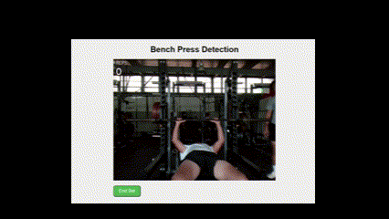

# Vitalitas - AI-Powered Gym Companion

**Vitalitas** is an AI-driven workout companion designed to assist users in performing exercises with real-time feedback. It offers functionalities like rep counting, exercise tracking, and both structured and freestyle workout plans to enhance the training experience. Though in prototype right now, Vitalitas will soon be available to the public via website. Once Vitalitas is hosted, a link to the website will be added to this readme. Vitalitas is partly inspired by Nicholas Renotte ([https://www.youtube.com/watch?v=06TE_U21FK4](https://www.youtube.com/@NicholasRenotte)).

## Features

- **Real-time Pose Tracking**: Uses AI to detect and count reps during various exercises like bench press, bicep curls, squats, pull-downs, and shoulder presses.
- **Exercise Tutorials and Safety**: Clear pages of instruction for fluid and safe sets of exercises.
- **Structured & Freestyle Workouts**: 
  - *Freestyle Mode*: Select specific exercises and perform sets with real-time feedback.
  - *Structured Mode*: Follow a guided workout routine with built-in rest periods and automatic exercise transitions.
- **Exercise History**: Track and manage past workouts, including reps, weight, and dates.
- **User Authentication**: Secure login and registration system with the option to access as a guest.
- **Responsive Web Interface**: User-friendly design that adapts to both desktop and mobile devices.

## Short Clip of Bench Press Functionality





## Screenshot of One of the Tutorial/Safety Pages: Bench Press


## Example Run Through of a Set of Bicep Curls 

Login Screen </b>


Home Screen </b>


Freestyle Screen </b>


Bicep Curl Weight Selection Screen </b>


Henry, one of my football teamates, doing curls </b>


Post Set Screen


## Features

- **Real-time Pose Tracking**: Uses AI to detect and count reps during various exercises like bench press, bicep curls, squats, pull-downs, and shoulder presses.
- **Structured & Freestyle Workouts**: 
  - *Freestyle Mode*: Select specific exercises and perform sets with real-time feedback.
  - *Structured Mode*: Follow a guided workout routine with built-in rest periods and automatic exercise transitions.
- **Exercise History**: Track and manage past workouts, including reps, weight, and dates.
- **User Authentication**: Secure login and registration system with the option to access as a guest.
- **Responsive Web Interface**: User-friendly design that adapts to both desktop and mobile devices.

## Tech Stack

- **Backend**: Flask (Python) - Manages user authentication, exercise tracking, and database interactions.
- **Frontend**: HTML, CSS, JavaScript - Provides an interactive interface for selecting exercises and displaying feedback.
- **Database**: Flask SQLAlchemy - Stores user information, workout history, and session data.
- **Pose Tracking**: Mediapipe - Real-time pose estimation for accurate exercise tracking.
- **Authentication**: Flask-Login, bcrypt - Provides secure user login, registration, and guest access.

## Installation

### Prerequisites

- Python 3.8+
- Virtual environment tool (e.g., `venv` or `virtualenv`)


## Usage

1. **Login/Register**: Access the app through the login page or register a new account.
2. **Select Workout Mode**: Choose between *Freestyle* and *Structured* workout modes:
   - *Freestyle*: Select exercises like Bicep Curl, Bench Press, Squat, Pull-Down, or Shoulder Press.
   - *Structured*: Follow a guided plan with multiple exercises, automatic breaks, and rep tracking.
3. **Input Weight & Start Exercise**: Enter the weight for the exercise, start the set, and get real-time feedback on your form and rep count.
4. **End Set & Review**: End the set to see your rep count and save the session to your exercise history.
5. **View History**: Navigate to *My Exercises* to review past workouts and track progress.

## Project Structure
```
website/
│
├── templates/            # HTML templates for the Flask app
│   ├── bench_press.html  # Bench Press detection page
│   ├── bicep_curl.html   # Bicep Curl detection page
│   ├── squat.html        # Squat detection page
│   ├── pull_down.html    # Pull-Down detection page
│   ├── shoulder_press.html # Shoulder Press detection page
│   ├── home.html         # Home page with workout options
│   ├── login.html        # Login page
│   ├── register.html     # Registration page
│   ├── my_exercises.html # User's exercise history
│   ├── structured.html   # Structured workout mode page
│   └── freestyle.html    # Freestyle exercise selection page
│
├── app.py                # Main Flask application
├── views.py              # Route definitions for the Flask app
├── static/               # Static files (CSS, images, etc.)
│   └── images/           # Image assets like the Vitalitas logo
├── requirements.txt      # Python dependencies


```


## Contributing

1. Fork the repository.
2. Create a new branch (`git checkout -b feature-branch`).
3. Make your changes.
4. Commit your changes (`git commit -m 'Add new feature'`).
5. Push to the branch (`git push origin feature-branch`).
6. Open a Pull Request.

## License

This project is licensed under the MIT License. See the `LICENSE` file for more details.

## Contact

For questions or support, please reach out to [joo-eon.kang@sstx.org].
